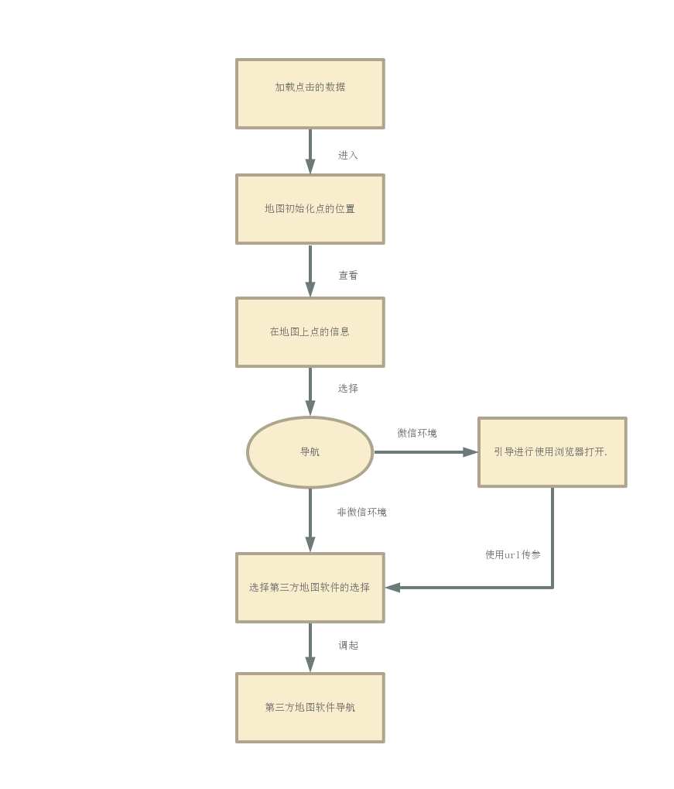

# opensysmap

## Project setup
```
npm install
```

### Compiles and hot-reloads for development
```
npm run serve
```

### Compiles and minifies for production
```
npm run build
```

### Run your tests
```
npm run test
```

### Lints and fixes files
```
npm run lint
```

### Customize configuration
See [Configuration Reference](https://cli.vuejs.org/config/).

### 设计流程图


###  vue cli3.0用axios调用本地json数据一直报404
最近在基于vue做后台管理系统时，用了vue cli3.0用axios调用本地json数据一直报404，市面上所有的解决办法都没用，快崩溃了，结果最后发现原因是，vue cli3.0 public 文件夹才是静态资源文件，问题解决，记录一下，以后不再踩坑。
